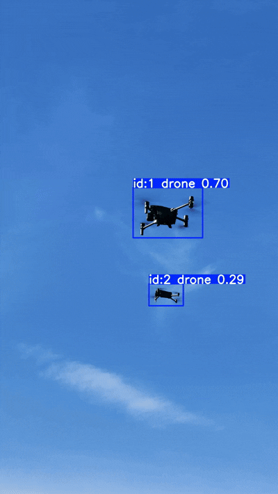
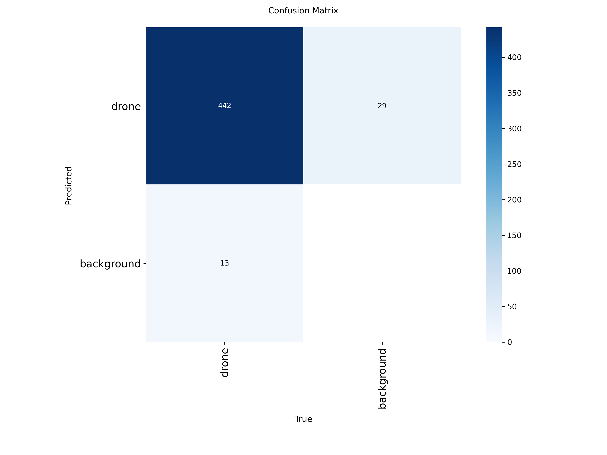
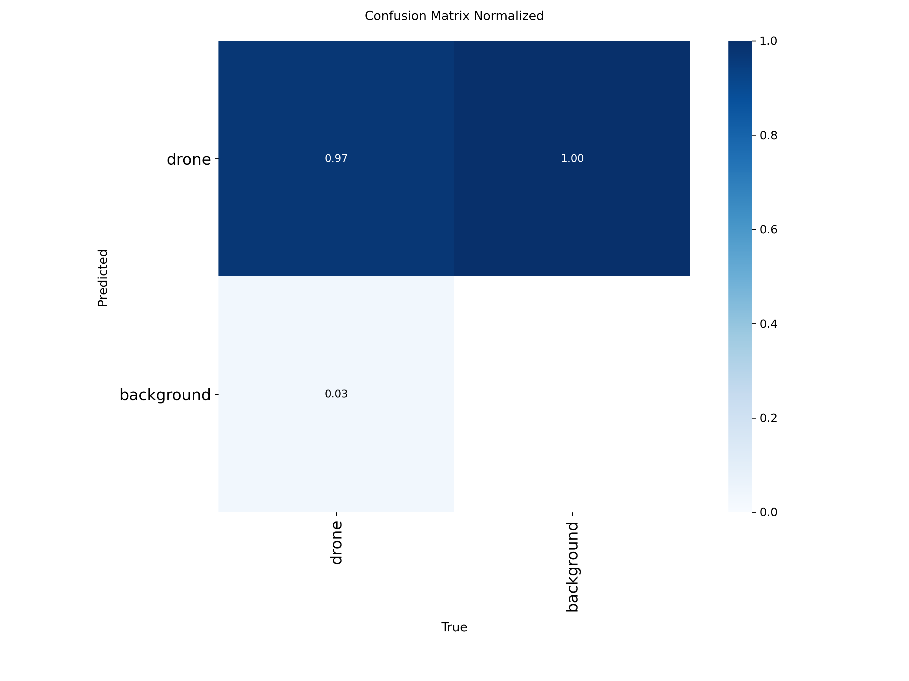
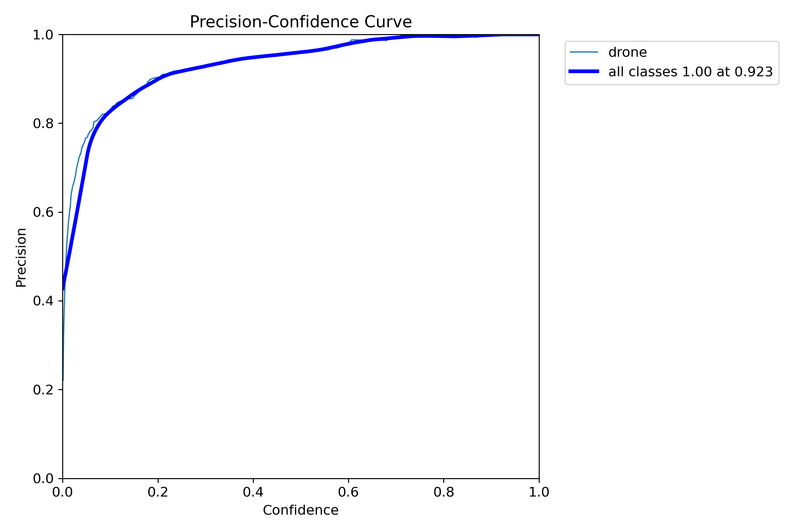
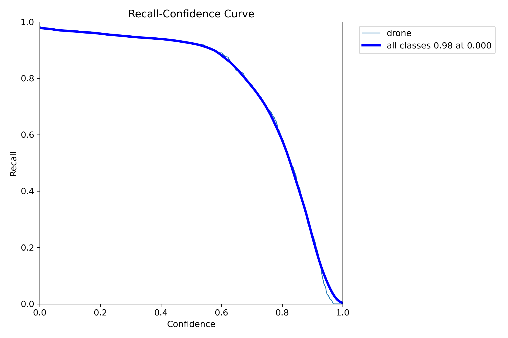
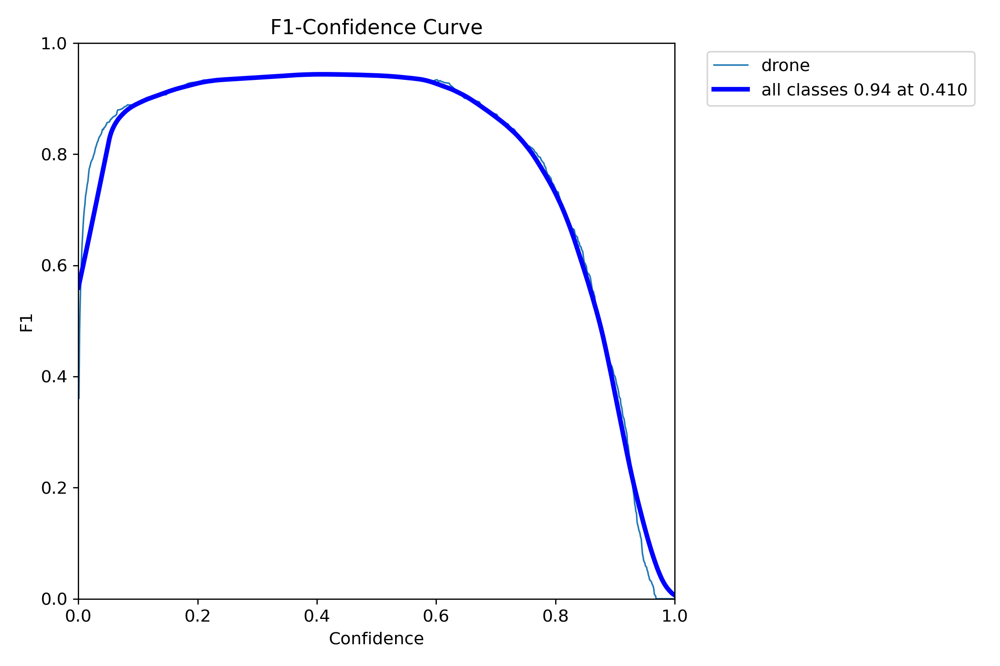
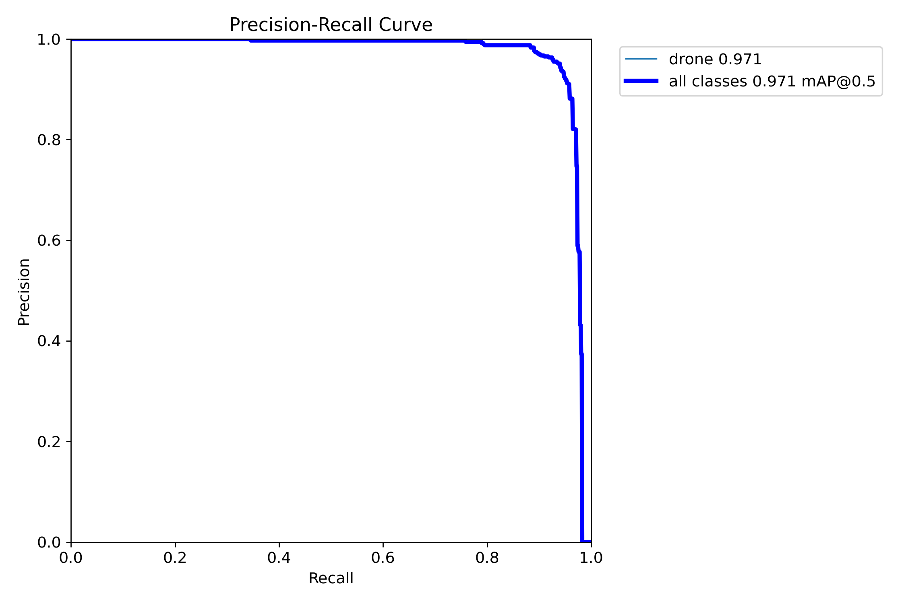

# 🚁 Drone Detection & Multi-Object Tracking

A computer vision pipeline for detecting and tracking drones in aerial video using YOLOv8n and ByteTrack.

The project trains a custom YOLOv8n detector on a UAV drone dataset and combines it with ByteTrack for persistent multi-drone tracking, including improved identity preservation during temporary overlap and occlusion.

---

## 🎬 Project Demonstration

### Multi-Drone Tracking

The final tracking demonstration shows two drones being detected and tracked simultaneously with persistent object IDs.

The tracking configuration was tuned to improve identity persistence when the drones temporarily overlap in the camera view.

---

## 📌 Project Overview

Small aerial objects such as drones can be difficult to detect and track because of their:

- Small size in the frame
- Rapid movement
- Similar appearance to background objects
- Camera motion
- Temporary overlap and occlusion

This project addresses the problem using a two-stage computer vision pipeline:

**Input Video**  
⬇️  
**YOLOv8n Object Detection**  
⬇️  
**Drone Bounding Boxes**  
⬇️  
**ByteTrack Multi-Object Tracking**  
⬇️  
**Persistent Drone IDs**  
⬇️  
**Tracked Video**

---

## 🧠 Technologies Used

| Technology | Purpose |
|---|---|
| Python | Programming language |
| YOLOv8n | Drone object detection |
| ByteTrack | Multi-object tracking |
| OpenCV | Video processing |
| Ultralytics | YOLO implementation and training |
| Roboflow | Dataset acquisition and preparation |
| Jupyter Notebook | Experimentation and training workflow |

---

## 📊 Dataset

The model was trained using the UAVs dataset in YOLOv8 format.

### Dataset Split

| Split | Images |
|---|---:|
| Training | 6,928 |
| Validation | 1,884 |
| Test | 450 |

The dataset contains a single object class:

drone

The complete dataset is not included in this repository because of its size.

---

## 🏋️ Model Training

The project uses YOLOv8n, initialized from the pretrained yolov8n.pt model.

### Training Configuration

| Parameter | Value |
|---|---:|
| Model | YOLOv8n |
| Epochs | 30 |
| Image Size | 640 × 640 |
| Batch Size | 16 |
| Classes | 1 |
| Optimizer | Auto |
| Pretrained | Yes |

Detailed training configuration is available in:

results/training_args.yaml

The complete experimental pipeline is available in:

notebooks/drone_detection_pipeline.ipynb

Training history is available in:

results/training_results.csv

---

## 📈 Final Test Results

The trained model was evaluated on the held-out test set.

| Metric | Result |
|---|---:|
| Precision | 95.11% |
| Recall | 94.01% |
| mAP@50 | 97.09% |
| mAP@50–95 | 71.39% |

### Evaluation Visualizations

#### Confusion Matrix

#### Normalized Confusion Matrix

#### Precision Curve

#### Recall Curve

#### F1 Score Curve

#### Precision-Recall Curve

---

## 🎯 Multi-Drone Tracking

The trained YOLOv8n detector is combined with ByteTrack for multi-object tracking.

The final tracker uses a custom configuration with the following parameters:

- track_high_thresh: 0.20
- track_low_thresh: 0.05
- new_track_thresh: 0.20
- track_buffer: 120
- match_thresh: 0.95
- fuse_score: True

The increased tracking buffer and association threshold were used to improve identity persistence when drones temporarily overlap or become difficult to distinguish.

The final demonstration successfully tracks two drones simultaneously with separate IDs.

---

## ⚡ Inference Performance

A frame-by-frame inference test was performed on the demonstration video.

- Frames processed: 356
- Elapsed time: 12.23 seconds
- Approximate inference throughput: 29.1 FPS

This value represents measured YOLO inference throughput using frame-by-frame prediction and should not be interpreted as a complete end-to-end tracking benchmark.

---

## 📁 Project Structure

<pre>
drone-detection-tracking/
│
├── models/
│   └── model_info.md
│
├── notebooks/
│   └── drone_detection_pipeline.ipynb
│
├── results/
│   ├── tracking_demo.gif
│   ├── training_results.csv
│   ├── training_args.yaml
│   │
│   └── metrics/
│       ├── confusion_matrix.png
│       ├── confusion_matrix_normalized.png
│       ├── BoxP_curve.png
│       ├── BoxR_curve.png
│       ├── BoxF1_curve.png
│       └── BoxPR_curve.png
│
├── src/
│   ├── detect.py
│   └── track.py
│
├── .gitignore
├── requirements.txt
└── README.md
</pre>

---

## 🚀 Installation

Clone the repository and install the required dependencies.

    git clone <YOUR_REPOSITORY_URL>
    cd drone-detection-tracking
    pip install -r requirements.txt

---

## 🔍 Running Drone Detection

Use the detection script with a trained YOLO model.

    python src/detect.py --model path/to/drone_yolov8n_best.pt --source path/to/input_video.mp4

Additional parameters can be specified.

    python src/detect.py --model path/to/drone_yolov8n_best.pt --source path/to/input_video.mp4 --conf 0.25 --imgsz 640

---

## 🎯 Running Multi-Drone Tracking

Run the ByteTrack pipeline using:

    python src/track.py --model path/to/drone_yolov8n_best.pt --source path/to/input_video.mp4

The script automatically creates the custom ByteTrack configuration used by the project.

---

## 💾 Model Weights

The trained model weights are not directly included in this repository.

Model information and training details are available in:

models/model_info.md

The final trained model is:

drone_yolov8n_best.pt

---

## ⚠️ Limitations

Although the system achieves strong detection performance, several challenges remain:

- Very small drones can be difficult to detect at long distances.
- Severe motion blur can reduce detection accuracy.
- Temporary occlusion can affect tracking identity.
- Camera motion can make association more difficult.
- Performance depends on video resolution and computational hardware.

The tracking configuration was specifically tuned to improve identity persistence during temporary drone overlap.

---

## 🔮 Future Improvements

Potential improvements include:

- Training with a larger and more diverse drone dataset
- Testing additional YOLO architectures
- Comparing ByteTrack with trackers such as BoT-SORT
- Improving detection of extremely small aerial targets
- GPU-optimized real-time deployment
- Edge deployment on embedded platforms
- Integration with aerial surveillance and autonomous UAV systems

---

## 👩‍💻 Author

Ashka Kumari
